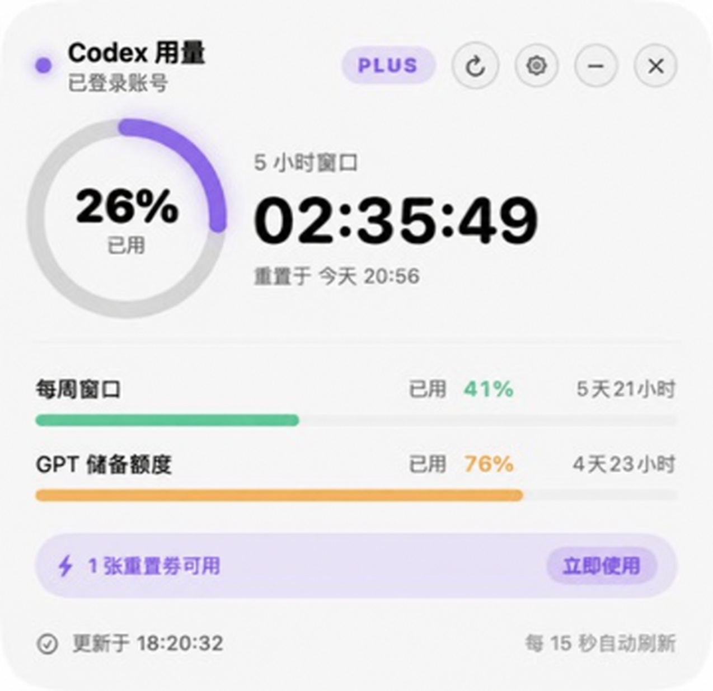

# Codex 用量 · 液态玻璃小卡片

macOS 26（Tahoe）原生的桌面悬浮小卡片，用真正的 **Liquid Glass（液态玻璃）** 材质实时显示
OpenAI Codex 的额度用量与重置倒计时。无 Dock 图标，只住在菜单栏和桌面上。

## 卡片预览



上图为本机实时读取后的卡片画面，账号信息已脱敏；额度和倒计时会随刷新而变化。

## 它显示什么

- **5 小时窗口**：环形仪表 + 已用百分比 + `HH:MM:SS` 重置倒计时 + 重置的绝对时间
- **每周窗口**：进度条 + 百分比 + 剩余时间
- **GPT 储备额度**（如账号存在该窗口）：同上
- **套餐标识**（PLUS / PRO …）与**重置券**提示（有几张可立即重置额度的券）
- 用量颜色随压力变化：<50% 薄荷绿，50–80% 琥珀，>80% 珊瑚红
- 菜单栏用量标记常驻显示主窗口用量，左键或右键点按都弹出选项菜单（显示卡片 / 刷新 / 退出）

## 数据从哪来

直接复用你本机已登录的 Codex CLI：启动一个 `codex app-server` 子进程，
通过它的 JSON-RPC 方法 `account/rateLimits/read` 读取额度快照。

- 不自己保存或传输任何 token，鉴权、刷新全部由 codex CLI 完成
- 只读查询，**不消耗模型额度**
- 每 5 分钟自动刷新一次，也可点卡片右上角按钮立即刷新
- 快照缓存在 `~/Library/Caches/CodexUsageCard/snapshot.json`，冷启动秒开

## 使用

```bash
./build.sh          # 编译并组装 Codex用量.app（已内置图标与 ad-hoc 签名）
open "Codex用量.app" # 启动
```

- 拖动卡片任意空白处可移动，位置会被记住
- 顶部菜单栏和卡片主圆环都会显示 5 小时已用百分比（如 `◔ 13%`），并使用同一套固定警示色：0–49% 绿、50–79% 黄、80–100% 红，不受主题色影响。顶部标记由 macOS 原生状态栏托管，不会再作为独立悬浮窗出现在屏幕上
- 重新构建图标：`./make_icon.sh`（用 SwiftUI 离屏渲染，无第三方素材）

修复菜单栏图标后，可运行以下回归检查，确认没有重新使用普通悬浮窗模拟菜单栏：

```bash
bash Tests/test_menu_bar_implementation.sh
```

## 交互与设置

卡片头部右侧四个圆形按钮：`⟳ 刷新`、` 设置`、`− 收起到顶部菜单栏`、`✕ 关闭`。

- **收起到顶部菜单栏**：隐藏桌面卡片，只保留顶部菜单栏的用量图标；点图标后从菜单选择“显示卡片”即可恢复
- **关闭**：隐藏卡片；点菜单栏图标后从菜单选择“显示卡片”即可唤回
- **设置**（同面板内切换，点 `✕` 返回）：
  - 开机自启：用 `SMAppService` 注册/注销登录项，一键开关
  - 外观：跟随系统 / 浅色 / 深色
  - 主题色：自动（随用量变色）或固定薄荷 / 天蓝 / 紫罗兰 / 暖橙
  - 自动刷新间隔：1 / 5 / 15 分钟
  - 所有设置持久化在 UserDefaults，重启后保留

## 重置券刷新 5 小时额度

Codex 的 5 小时窗口是**纯时钟驱动**的滚动窗口（背靠背连续，与用量无关），发消息不会让它提前重置；
ChatGPT 网页与 Codex 也是两套独立额度池。真正能立即重置的官方机制是**重置券**
（`account/rateLimitResetCredit/consume`）。

- 卡片重置券横幅上的 **立即使用** → 变成 **确认使用？**（3 秒内再点一次才消耗，防误触）
- 消耗成功后：卡片顶部弹出"5 小时额度已刷新"胶囊提示 + 系统通知，并立即重读最新额度
- 设置里的 **额度耗尽时自动用券** 开关（默认关）：5 小时额度用尽且账户有券时自动消耗一张
- 券由 OpenAI 不定期发放、非常稀缺，所以自动逻辑默认关闭

## 目录

```
Package.swift                     SwiftPM 工程（macOS 26 / Swift 6）
Sources/CodexUsageCard/
  App.swift                       入口、悬浮 NSPanel、菜单栏、预览渲染
  CardView.swift                  液态玻璃卡片 UI（环、进度条、横幅）
  Provider.swift                  codex app-server 客户端 + 磁盘缓存
  Store.swift                     状态与定时刷新
  Models.swift                    数据模型与中文时间格式化
  SettingsView.swift              设置页（登录项/外观/主题色/刷新间隔）
  Icon.swift                      应用图标离屏绘制
build.sh / make_icon.sh           打包脚本
Assets/AppIcon.icns               生成的图标
docs/card-preview.png             README 展示图（实时界面，已脱敏）
```

## 常见问题

- **卡片空白 / 显示“未找到 codex CLI”**：确认 `codex --version` 可用且已 `codex login`。
  也可用环境变量 `CODEX_BIN` 指定二进制路径。
- **看不到玻璃质感**：液态玻璃需要 macOS 26 及以上；本工具最低系统要求即 26.0。
- **想改刷新频率 / 配色 / 开机自启**：卡片齿轮按钮 → 设置。

## 隐私

所有数据只在本机读取与显示，不上传、不埋点、无网络外发（除 codex CLI 自身与 OpenAI 的鉴权通信）。
